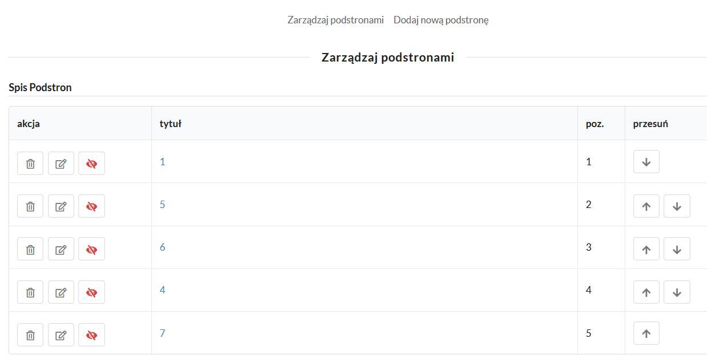

# Zarządzanie instytucjami

## Zarządzanie podstronami

Można zmienić kolejność postron za pomocą ikon strzałek po prawej stronie. Akcja ta nie pyta o potwierdzenie ale też jest łatwa do odwrócenia.
W przypadku usunięcia jednej z podstron, pozostałe zostaną odpowiednio przenumerowane.

