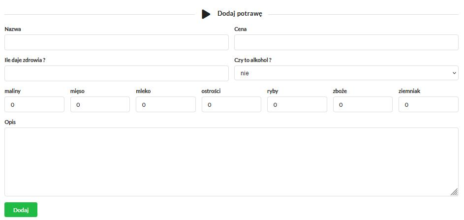
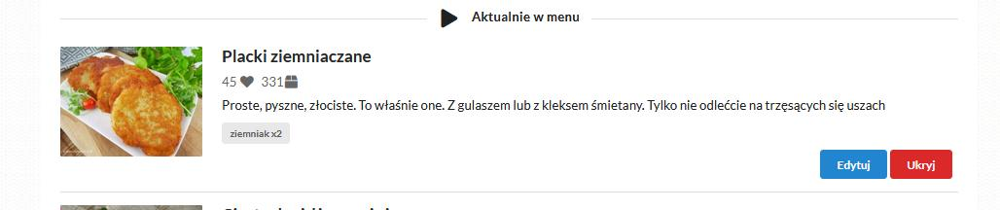
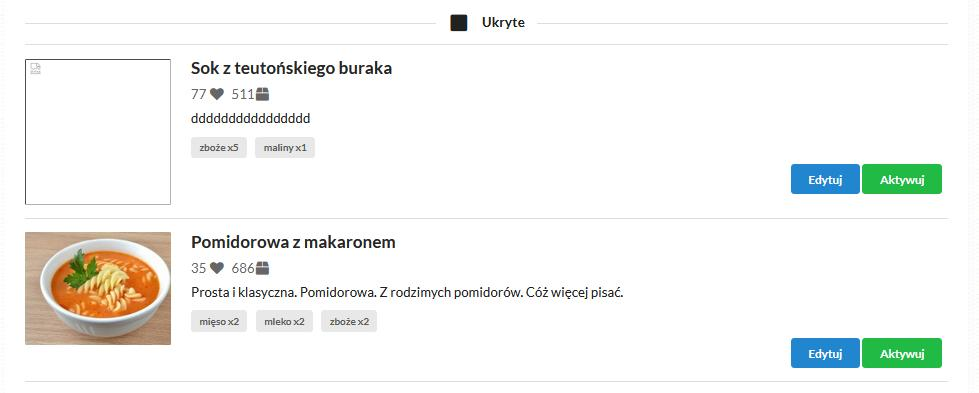
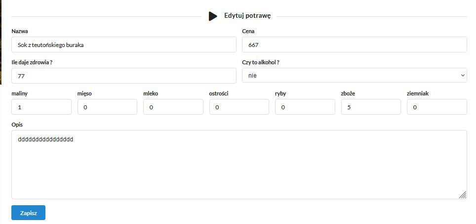

# Menu Karczmy

Po wejściu w opcję **Zarządzanie karczmą** zobaczymy trzy sekcje:

1. Formularz dodawania potraw
2. Listę potraw będących w menu
3. Listę ukrytych potraw

## Formularz dodawania

Wypełnij formularz. Pamiętaj, że musisz wybrać przynajmniej jeden składnik. W przypadku błędu dane z formularza przepadną więc lepiej mieć przygotowane wartości na boku.

Nowo dodana potrawa będzie **Ukryta**. Później trzeba ją aktywować.

## Lista potraw będących w menu

Dla każdej potrawy w menu masz dostępne dwie akcje:

1. Ukryj
2. Edytuj

## Lista ukrytych potraw

Dla każdej ukrytej potrawy masz dostępne dwie akcje:

1. Aktywuj
2. Edytuj

## Edycja

Po wyborze opcji **Edytuj**, czy to dla potrawy aktywnej czy ukrytej, ponad formularzem dodawania pojawi się formularz edycji z danymi wybranej potrawy.
Uwagi dotyczące dodawania dotyczą również edycji.

