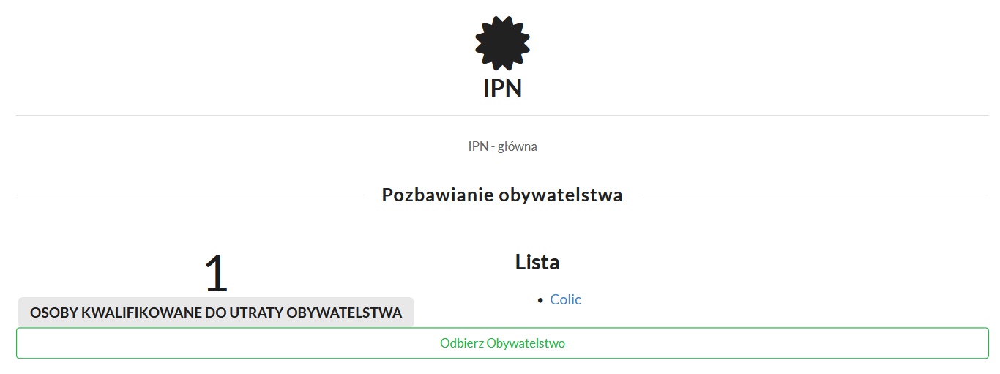

# Odbieranie obywatelstwa

## Nieaktywnym

Wybierz opcję **Stwierdź utratę obywatelstw przez nieaktywnych**. Otwarty formularz wyświetli ile osób kwalifikuje się do utraty obywatelstwa oraz listę tych osób.
Po naciśnięciu **Odbierz Obywatelstwo** stosowne zmiany zostaną wykonane na bazie danych a także zostanie opublikowany akt w Dzienniku Praw.

