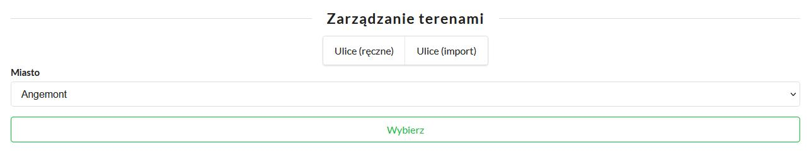
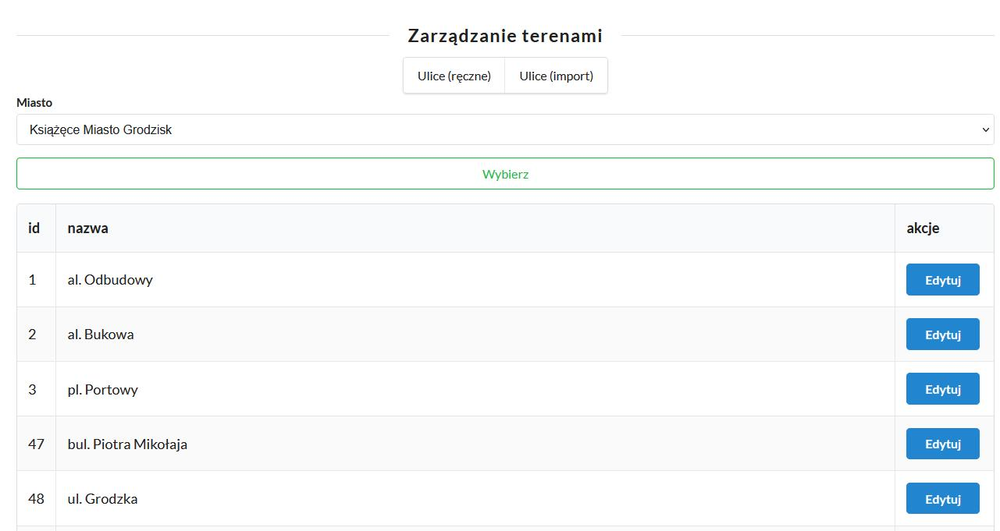
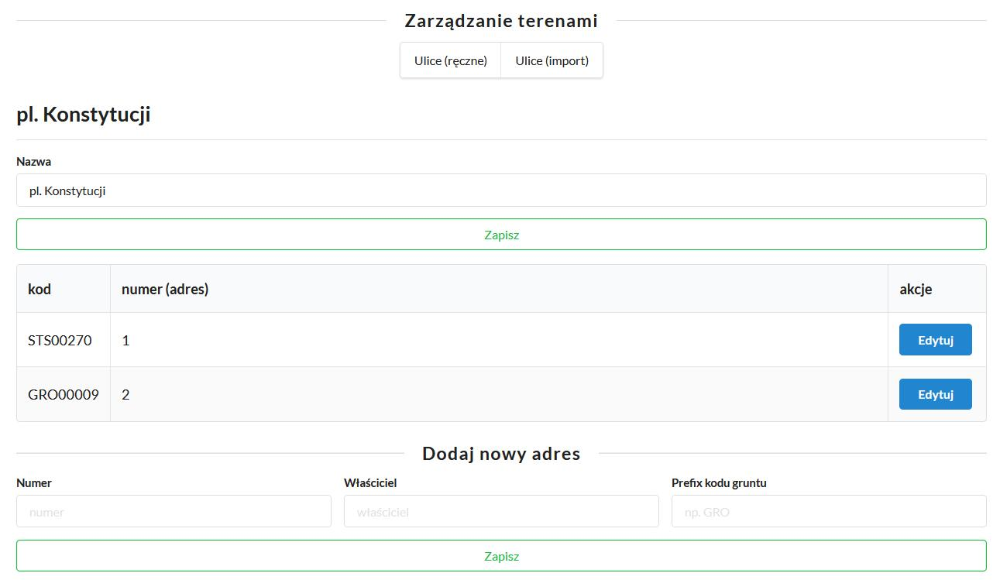
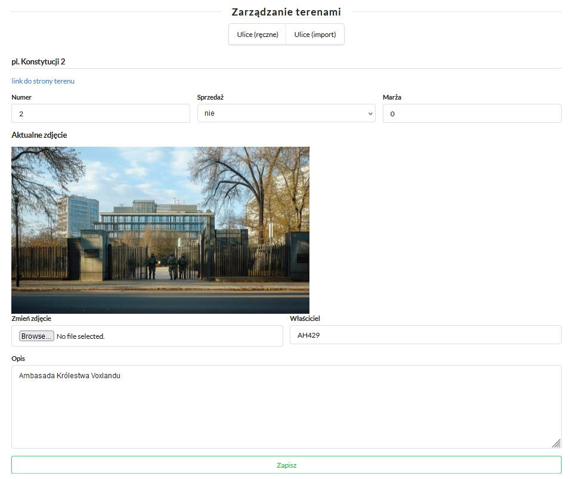

# Zarządzanie terenami

Poza opcjami wgrywania terenów i ulic plikami CSV (dla których dokumentacji jeszcze tutaj nie ma) panel IPN pozwala również na ręczne nimi zrządzanie.

Po wejściu w opcję "Ręczne zarządzanie terenami" otrzymujemy formularz wyboru miasta w którym chcemy kontynuować pracę.



Po wyborze miasta otrzymamy listę ulic w danym mieście.
Mozemy wybrać którą ulicę chcemy edytować.



W ramach edycji ulicy możemy zmienić jej nazwę, edytować tereny z nią powiązane oraz utworzyć nowy teren w ramach ulicy.
Tworząc nowy teren nie mamy możliwości zdefiniowania jego szczegółów. Dopiero po utworzeniu możemy go wyedytowac.



Po przejściu w edycję terenu możemy ustawić wszystkie najważniejsze informacje - w tym wgrać zdjęcie.
**Maksymalny rozmiar zdjęcia w pionie i w poziomie to 600px.** Na chwilę obecną zdjęcie nie zostanie przeskalowane automatycznie a próba wgrania zbyt dużego skończy się błędem.



Dla bardziej opisowych terenów mamy również dwa pola przyjmujące **bbcode** - "długi opis" oraz "odnośniki".
W przypadku odnośników oczywiście zalecane jest użycie znaczników **url**

```
[url=][/url]
```