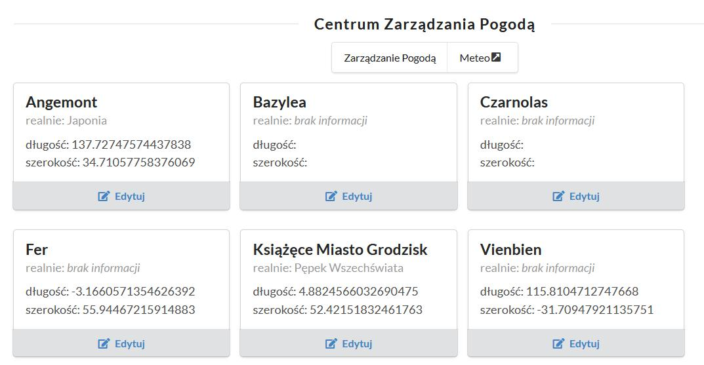
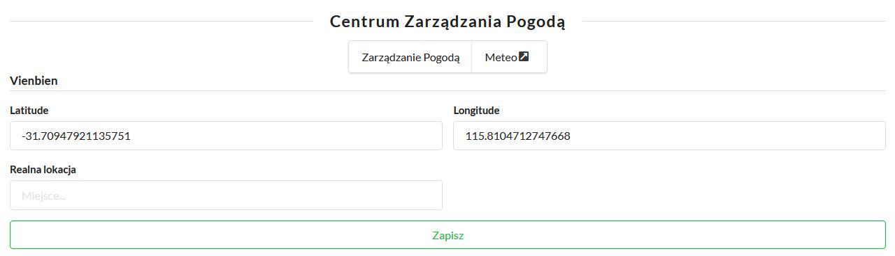

# Pogoda

Dane o pogodzie dla miejscowości pobieramy z API `https://api.openweathermap.org/data/2.5/weather?lat=44.34&lon=10.99&appid=`
Każda miejscowość ma przypisane współrzędne odpowiadające jakiejś prawdziwej lokalizacji.

## Centrum Zarządzania Pogodą

Panel IPN umożliwia edycję ustawień dla każdej z nieukrytych miejscowości - również tych nie wyświetlanych na stronie głównek w rubryce pogody.

Po przejściu do edycji możemy ustawić długość i szerokość geograficzną oraz dodać komentarz na temat realnej lokalizacji.

## Aktualizacja danych

Dane o aktualnej pogodzie są pobierane co godzinę z API dla wszystkich miejscowości o ustawionych współrzędnych. Są one zapisywane do naszej bazy danych.
